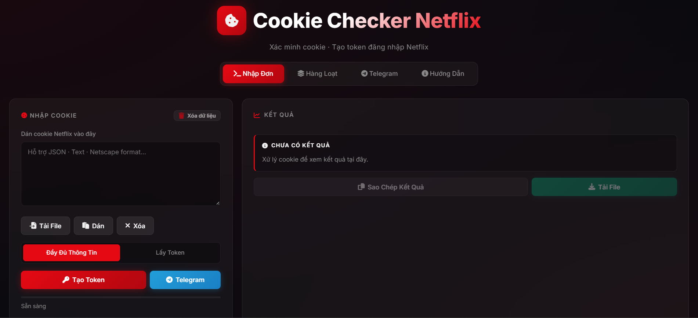

<div align="center">

# Cookie Checker Netflix

**Kiểm tra cookie và tự động khởi tạo token đăng nhập Netflix**

[](https://developer.mozilla.org/en-US/docs/Web/JavaScript)
[](https://nodejs.org/)
[](https://www.python.org/)
[](https://www.w3.org/Style/CSS/)
[](https://vercel.com/)
[](./LICENSE)

[](https://github.com/huyvu2512/cookie-checker/stargazers)
[](https://github.com/huyvu2512/cookie-checker/forks)
[](https://github.com/huyvu2512/cookie-checker/issues)
[](https://github.com/huyvu2512/cookie-checker/commits/main)


[Xem Website](https://cookiecheckernetflix.vercel.app/) · [Báo Lỗi](https://github.com/huyvu2512/cookie-checker/issues) · [Yêu Cầu Tính Năng](https://github.com/huyvu2512/cookie-checker/issues)

</div>

---

<div align="center">
  
</div>

---

## Giới thiệu

Cookie Checker Netflix là ứng dụng hỗ trợ kiểm tra cookie và tự động khởi tạo token đăng nhập Netflix trực tiếp trên nền tảng trình duyệt và API serverless. Sản phẩm được thiết kế và phát triển bởi Huy Vũ (@huyvu2512) với mục tiêu nghiên cứu chuyên sâu về cơ chế quản lý phiên, giao thức truyền thông web và ứng dụng thực tiễn của API.

Hệ thống hỗ trợ trích xuất NetflixId từ nhiều định dạng dữ liệu cookie khác nhau như chuỗi văn bản thuần, mảng JSON (EditThisCookie) hoặc định dạng Netscape tiêu chuẩn. Sau khi xác thực tài khoản, hệ thống giả lập gói tin tương thích để khởi tạo nftoken, cung cấp đường dẫn đăng nhập một chạm cho cả điện thoại di động và máy tính mà không cần nhập mật khẩu.

---

## Tính năng chính

- Trích xuất NetflixId đa định dạng - Nhận diện và bóc tách NetflixId từ văn bản thô, tiêu đề request, tệp JSON EditThisCookie hoặc định dạng Netscape tiêu chuẩn.
- Kiểm tra chi tiết tài khoản - Xác thực gói cước, trạng thái Premium, quốc gia đăng ký, ngày gia hạn kế tiếp, email, số điện thoại và danh sách hồ sơ người dùng.
- Khởi tạo token đăng nhập trực tiếp - Tạo mã token nftoken theo thời gian thực kèm đường dẫn đăng nhập nhanh cho điện thoại và trình duyệt máy tính.
- Đếm ngược hạn dùng token - Tích hợp đồng hồ đếm ngược thời gian sống thực tế của token ngay trên giao diện kết quả.
- Xử lý hàng loạt - Hỗ trợ tải lên cùng lúc nhiều tệp .txt hoặc tệp nén .zip chứa danh sách cookie và xuất toàn bộ kết quả thành tệp nén ZIP tiện lợi.
- Tiện ích kích hoạt Netflix TV - Nhập mã xác nhận 8 chữ số trên TV để tự động sao chép vào bộ nhớ tạm và mở trang xác thực netflix.com/tv2.
- Tích hợp Telegram Bot - Gửi báo cáo kết quả tài khoản hợp lệ tới nhiều Chat ID đồng thời thông qua Telegram Bot API.
- Lưu trữ cục bộ an toàn - Tích hợp localStorage để lưu trữ cấu hình, nội dung cookie và kết quả phiên làm việc mà không cần hệ quản trị cơ sở dữ liệu trung gian.
- Giao diện tối ưu - Thiết kế giao diện nền tối (Dark mode) tinh tế, hiển thị tương thích mượt mà trên cả máy tính để bàn và thiết bị di động.
- Theo dõi hệ thống - Tích hợp sẵn Vercel Web Analytics và Speed Insights để theo dõi lưu lượng truy cập và chỉ số hiệu năng trang web.

---

## Công nghệ

| Thành phần | Công nghệ |
| :--- | :--- |
| Frontend | HTML5, Vanilla JavaScript |
| Styling | Vanilla CSS3 (Dark Theme, Glassmorphism) |
| Backend chính | Node.js, Express |
| Backend dự phòng | Python 3, Flask |
| Thư viện hỗ trợ | Multer, Adm-Zip, Axios, JSZip |
| Triển khai | Vercel Edge Network |

---

## Cấu trúc thư mục

```text
cookie-checker/
├── public/                       # Frontend tĩnh và tài nguyên web
│   ├── assets/                   # Hình ảnh, logo và ảnh xem trước
│   │   ├── apple-touch-icon.png
│   │   ├── favicon-32x32.png
│   │   ├── favicon.png
│   │   └── preview.png
│   ├── favicon.ico               # Favicon chuẩn phục vụ crawler Vercel
│   ├── index.html                # Giao diện người dùng chính
│   ├── manifest.json             # Cấu hình Web App Manifest (PWA)
│   ├── robots.txt                # Cấu hình chỉ mục công cụ tìm kiếm
│   ├── script.js                 # Logic Frontend, gọi API và đếm ngược
│   ├── sitemap.xml               # Sơ đồ trang web phục vụ SEO
│   └── style.css                 # Hệ thống styling giao diện Dark theme
├── server.js                     # Backend Server Node.js / Express
├── api.py                        # Backend Server Python / Flask dự phòng
├── package.json                  # Cấu hình npm và scripts khởi chạy
├── package-lock.json             # Khóa phiên bản thư viện npm
├── requirements.txt              # Danh sách thư viện Python
├── vercel.json                   # Cấu hình định tuyến Vercel
├── SECURITY.md                   # Chính sách bảo mật và quy trình báo lỗi
├── LICENSE                       # Giấy phép mã nguồn mở MIT
└── README.md                     # Tài liệu hướng dẫn dự án
```

---

## Khởi chạy nhanh

### Yêu cầu môi trường
- Node.js phiên bản 18 trở lên (khuyên dùng cho môi trường chính)
- Hoặc Python phiên bản 3.8 trở lên nếu sử dụng backend Flask

### Cài đặt và vận hành (Node.js)

```bash
# 1. Clone kho mã nguồn
git clone https://github.com/huyvu2512/cookie-checker.git
cd cookie-checker

# 2. Cài đặt các gói thư viện
npm install

# 3. Chạy server phát triển
npm run dev

# Mở trình duyệt tại: http://localhost:3000
```

### Vận hành bằng Python (Tùy chọn)

```bash
# 1. Cài đặt thư viện Python
pip install -r requirements.txt

# 2. Chạy server Flask
python api.py
```

---

## Triển khai Vercel

1. Đẩy mã nguồn dự án lên kho lưu trữ GitHub cá nhân.
2. Đăng nhập vào Vercel Dashboard và chọn Add New Project.
3. Chọn repository `cookie-checker`.
4. Hệ thống Vercel sẽ tự động nhận diện cấu hình thông qua `vercel.json` hoặc `package.json`.
5. Nhấn Deploy để hoàn tất quy trình triển khai.
6. Truy cập mục Analytics và Speed Insights trên Vercel để kích hoạt hệ thống đo lường lưu lượng và tốc độ trang.

---

## API Overview

Hệ thống cung cấp các endpoint backend phục vụ xử lý cookie và cấu hình:

| Endpoint | Method | Mô tả |
| :--- | :--- | :--- |
| `/api/check` | POST | Trích xuất NetflixId, kiểm tra tài khoản và tạo token đăng nhập |
| `/api/batch-check` | POST | Xử lý hàng loạt các tệp cookie định dạng .txt và .zip |
| `/api/telegram-config` | POST | Cập nhật thông tin Bot Token và danh sách Chat ID nhận thông báo |

---

## Tài liệu

| Tài liệu | Nội dung |
| :--- | :--- |
| [SECURITY.md](./SECURITY.md) | Chính sách bảo mật, xử lý dữ liệu và quy trình báo cáo lỗ hổng |
| [LICENSE](./LICENSE) | Giấy phép mã nguồn mở MIT |

---

## Tuyên bố miễn trừ trách nhiệm

Dự án này được tạo ra hoàn toàn vì mục đích học tập, nghiên cứu về cơ chế xác thực phiên và kiến trúc API mang tính chất phi thương mại. Dự án không liên kết, không được tài trợ và không đại diện cho Netflix Inc. Tên gọi, thương hiệu "Netflix" và các nhãn hiệu liên quan thuộc quyền sở hữu của Netflix Inc.

Mọi hành vi sử dụng công cụ này vào mục đích trái phép, xâm phạm quyền riêng tư hoặc gây tổn hại tới hệ thống của bên thứ ba đều bị nghiêm cấm. Người sử dụng phải tự chịu hoàn toàn trách nhiệm pháp lý trước mọi hành vi và hậu quả phát sinh từ việc sử dụng mã nguồn này. Tác giả hoàn toàn không chịu bất kỳ trách nhiệm nào liên quan đến việc sử dụng sai mục đích của người dùng.

---

## Giấy phép

Mã nguồn được phát hành theo giấy phép [MIT License](./LICENSE).
